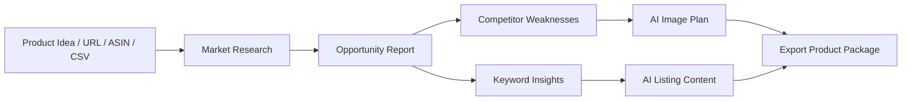
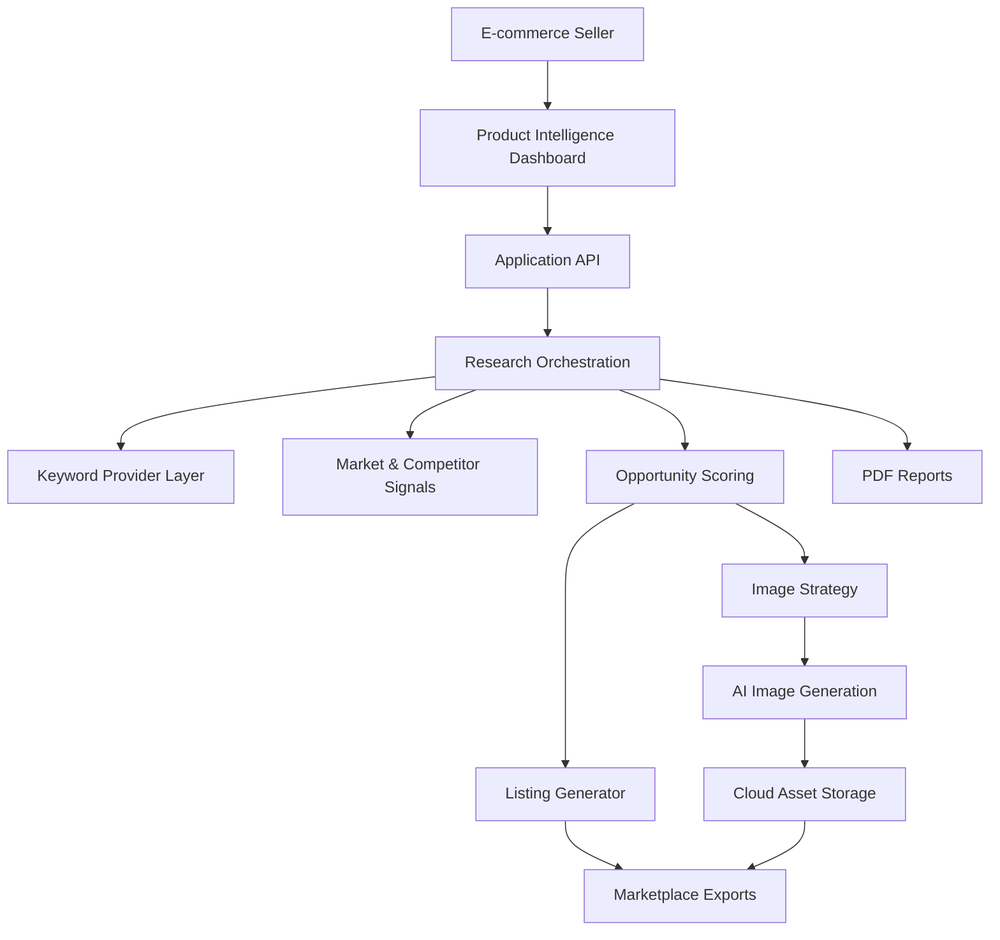

# MarketForge AI

> AI commerce intelligence platform helping e-commerce sellers turn product ideas into research-backed listings, visuals, and export-ready selling packages.

MarketForge AI is the public portfolio identity for the former Hichem-AI / Image Factory project. It combines product image acquisition, product intelligence, keyword research, competitor analysis, AI image generation, regional audience targeting, cloud asset management, and product content automation.

This repository is a public product showcase. Production code, scraping strategies, AI prompts, provider integrations, credentials, and operational workflows are intentionally private.

## Table Of Contents

- [Overview](#overview)
- [Business Problem](#business-problem)
- [Solution](#solution)
- [Key Features](#key-features)
- [Product Screenshots](#product-screenshots)
- [Architecture Overview](#architecture-overview)
- [Technology Stack](#technology-stack)
- [Future Roadmap](#future-roadmap)
- [Contact](#contact)

## Overview

MarketForge AI helps e-commerce businesses answer a simple commercial question:

**Should I spend money importing this product?**

The platform turns a product URL, supplier link, Amazon ASIN, CSV import, or product idea into a structured opportunity report with market demand, competition, keyword opportunity, listing recommendations, and an AI image plan.

## Business Problem

E-commerce sellers often struggle to:

- Find profitable products before spending on inventory.
- Understand keyword demand and competitor pressure.
- Create high-quality product visuals.
- Produce optimized listings quickly.
- Adapt marketing assets for regional audiences.
- Export product packages into selling channels.

## Solution

MarketForge AI combines product research, listing automation, and image generation into one seller workflow:

The result is a sales-ready product package with research context, copy, keywords, visual strategy, and export formats for commerce workflows.

## Key Features

### Product Intelligence

- Product opportunity scoring.
- Market demand analysis.
- Keyword insights.
- Competitor analysis.
- Score explanation and seller recommendation.
- Product comparison reports.

### AI Content Generation

- Product titles.
- SEO descriptions.
- Marketplace listing copy.
- Ad copy and product metadata.

### AI Visual Generation

- Premium product image strategy.
- Lifestyle image planning.
- Feature comparison visuals.
- Dimensions and benefit infographics.
- Regional audience creative adaptation.

### Cloud Asset Management

- Cloud storage integration.
- Export workflows.
- Product package downloads.
- Team-ready report assets.

## Product Screenshots

Screenshots should be captured from a sanitized demo environment only.

- Hero dashboard screenshot: `screenshots/01-product-intelligence-dashboard.png`
- Product opportunity report: `screenshots/02-opportunity-report.png`
- Keyword explorer: `screenshots/03-keyword-explorer.png`
- Competitor analysis: `screenshots/04-competitor-analysis.png`
- AI image plan: `screenshots/05-ai-image-plan.png`
- Export report: `screenshots/06-product-package-export.png`

See [docs/screenshots/README.md](docs/screenshots/README.md) for capture guidelines.

## Architecture Overview

Only the platform architecture is documented publicly. Core scraping logic, provider clients, scoring details, prompts, credentials, and automation internals remain private.

## Technology Stack

| Layer | Technologies |
| --- | --- |
| Dashboard | Next.js, React, TypeScript |
| API | FastAPI, Python |
| Workers | Celery, background processing |
| Data | PostgreSQL, Redis |
| AI | Image generation, image processing, content automation |
| Integrations | Keyword research providers, product research providers, cloud storage |
| Infrastructure | Docker, containerized services |
| Reporting | PDF and CSV export workflows |

## Future Roadmap

- Real Google Keyword Planner integration.
- Real Helium 10-style provider integration.
- Supplier discovery workflows.
- Amazon, Shopify, and WooCommerce export templates.
- User accounts, credits, plans, and team collaboration.
- Investor-ready and partner-ready product reports.

## Repository Topics

Recommended GitHub topics:

`ecommerce`, `artificial-intelligence`, `product-research`, `web-scraping`, `ai-automation`, `saas`, `computer-vision`

## Contact

This project is available as a private technical walkthrough, architecture discussion, or client demo on request.
