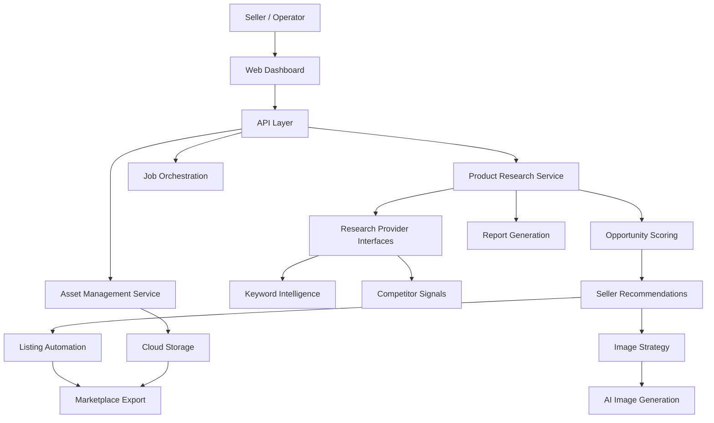
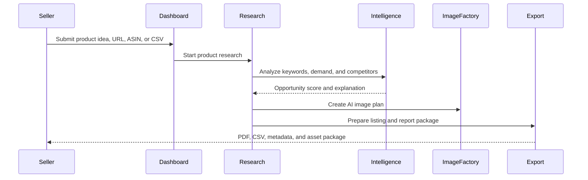

# Architecture

MarketForge AI is presented publicly as an AI commerce intelligence platform. This document describes the system at product architecture level without exposing proprietary internals.

## System Context

## Core Product Workflow

## Public Boundary

Included in this showcase:

- Product positioning.
- Feature descriptions.
- Architecture diagrams.
- Roadmap.
- Screenshot plan.

Excluded from this showcase:

- Production source code.
- Scraping strategies and site-specific extractors.
- AI prompts, scoring internals, and provider logic.
- API keys, tokens, cloud credentials, and private URLs.
- Database files and internal schemas.
- Customer, supplier, or product research data.
